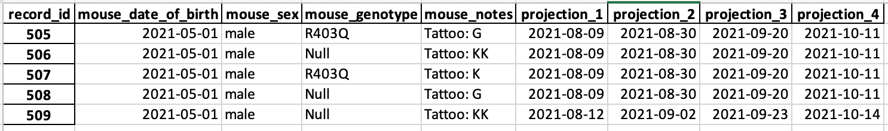
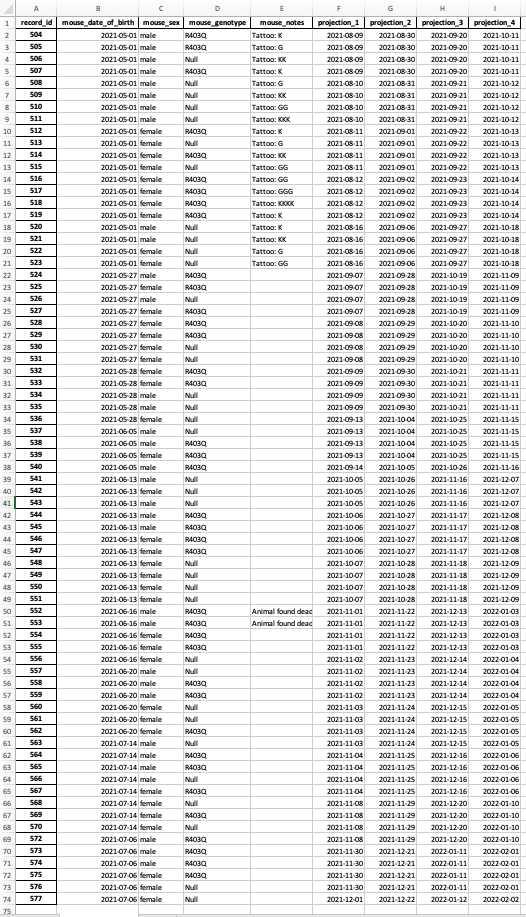
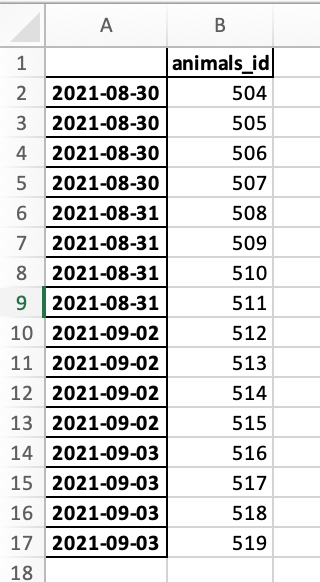

# proj_MRI: project timetable for MRI scanning


**proj_MRI** is a tool written in Python to help researchers to design a timetable for MRI scannig a large number of animals. 

Right now, the proj_MRI is designed for MMoTH group to predict the MRI scanning timetable at the University of Kentucky. 

## Installation
To use **proj_MRI**, first the repository needs to be downloaded from github [repository](https://github.com/HosseinSharifii/proj_MRI). 

To clone the repository:
1. In terminal prompt, navigate to an empty folder that you want to download the repository into. 

2. execute below command:

`$ git clone https://github.com/HosseinSharifii/proj_MRI.git`

3. In couple of seconds you will have the repository downloaded into your local computer. 

## Dependencies

**proj_MRI** uses following python modules:
1. [os](https://docs.python.org/3/library/os.html)
2. [JSON](https://docs.python.org/3/library/json.html)
3. [sys](https://docs.python.org/3/library/sys.html)
4. [NumPy](https://numpy.org/)
5. [pandas](https://pandas.pydata.org/)
6. [datetime](https://docs.python.org/3/library/datetime.html)
7. [calendar](https://docs.python.org/3/library/calendar.html)
8. [PyCap](https://pycap.readthedocs.io/en/latest/index.html)

- Usually, the first 7 modules are included in [anaconda](https://www.anaconda.com/) environment and thus you don't need to install them again. 

- [PyCap](https://pycap.readthedocs.io/en/latest/index.html) modules is the only one you need to manually install on your computer. To do that use [pip](https://pypi.org/project/pip/) command:

`$ pip install PyCap`

- [PyCap](https://pycap.readthedocs.io/en/latest/index.html) is an interface to the [REDCap](https://www.project-redcap.org/) Application Programming Interface (API).

## Documentation

After clonning the **proj_MRI** repository into your local computer and making sure all dependencies are satisfied, you can run the code!

- First open your terminal prompt and then navigate to the **proj_MRI** repository folder:
`$ cd <path-to-repository-directory>/python_code`

- To run the code, user must pass in an "instruction" file in [JSON](https://docs.python.org/3/library/json.html) format to the code. "Instruction" file handles the inputs that code uses to project the scanning timetable.

- To run the code and passing in an "instruction" file, path to the "instruction" file should pass in after calling the python code in your terminal prompt window. 

`$ python proj_MRI.py <path-to-instruction-file-directory>`

### Instruction file

"Instruction" file cntains three main sections. 

1. "pull_data" section includes the required inforamtion to pull animalls data and start generating the scanning timetable. 
````javascript
"pull_data":
    {
        "data_source":"redcap",
        "redcap":
        {
            "api_key":"532C4251FCD057B38C48B04CF928E8E9",
            "url_address":"https://redcap.uky.edu/redcap/api/"
        },
        "local_data":
        {
            "data_file_str":"../demos/data/mice_list.csv"
        },
        "animals_col_name": "record_id",
        "animals_to_pick":[504]
    }
````
**Parameters:**

| **Key** | **Type** | **Comment** |
| ------ | ------- | ---------- |
| data_source | str | keyword to the source where the code should be pulled from. It can be either "redcap" to pull data from [REDCap](https://www.project-redcap.org/) or "local_data" to read data from the local directory. |
| api_key | str | API key to the stored data on [REDCap](https://www.project-redcap.org/).|
| url_address | str | URL address to the study data stored on [REDCap](https://www.project-redcap.org/). |
| data_file_str | str | Path to the directory where the data is stored on your local computer. |
| animals_col_name | str, optional | Name of column in the data file in which the animals ID is stored.  |
| animals_to_pick | array | List of animal IDs in "animals_col_name" that you want to include in the scanning projection. To include all animals just keyword "all" in the array. |

2. "projection_data" section contains information for projecting the timetable for scanning. 

````javascript
"projection_data":
    {
        "initial_scan_age_weeks":14,
        "frequency_in_days": 21,
        "max_scan_reps":4,
        "max_animals_per_day":4,
        "scan_days": ["Mon","Tue","Thu","Fri"],
        "output_file_str": "../demos/demo_1/proj_mice_data.xlsx"
    }
````

**Parameters:**

| **Key** | **Type** | **Comment** |
| ------ | ------- | ---------- |
| initial_scan_age_weeks | int | Minimum age of animals in weeks to start the scanning. |
| frequency_in_days | int | Frequency of scanning in days.|
| max_scan_reps | in | Maximum number of scanning during the whole study. |
| max_animals_per_day | int | Maximum number of animals for each scanning session. |
| scan_days | array | List of days of a week that scanning can be acquired. |
| output_file_str | str | Path to the directory where the output projected data should be stored on your local computer. |

3. "animals_to_scan" section handles the information for determining which animals to scan for a assigned date range.
````javascript
"animals_to_scan":
    {
        "from_date":"8/25/2021",
        "to_date":"09/30/2021",
        "date_format": "%m/%d/%Y",
        "output_file_str": "../demos/demo_1/animals_to_scan.xlsx"
    } 
````
**Parameters:**

| **Key** | **Type** | **Comment** |
| ------ | ------- | ---------- |
| from_date | str | Starting date to pick the animals to scan. |
| to_date | str | Ending date to pick the animals to scan..|
| date_format | str, optional | Format of inputted dates. Default is "%m/%d/%Y". |

## Demos

The best way to understand the code is to run demos. 
In the repository folder you can find three demos.

1. demo_1 pulls data from a data spread sheet on your local computer and project 4 sessions of scanning for selected animals in `demo_1.json` file. 

    - Run the code with following command: `$ python proj_MRI.py ../demos/demo_1/demo_1.json`

    - Output "projection" file should be stored in *demo_1* folder and it should look like this. 

    

    - **Note**: Since Monday and Thursday are selected as the preffered days for scanning, all projections for this demo are in these two weekdays. 

2. demo_2 pulls data from [REDCap](https://www.project-redcap.org/) and generate the "projection" file for all animals.

    - Run the code with following command: `$ python proj_MRI.py ../demos/demo_2/demo_2.json`

    - **Note**: Since no preference is assigned for "scan_days", **proj_MRI** uses all weekdays from Monday to Friday to assign to scannings. 

    

3. Similar to demo_2, demo_3 pulls data from [REDCap](https://www.project-redcap.org/) and generate the "projection" file for all animals.

    - Run the code with following command: `$ python proj_MRI.py ../demos/demo_3/demo_3.json`

    - In addition to the projection file, **proj_MRI** determined which animals to scan for the specified date range in *demo_3.json* file. 

    
    